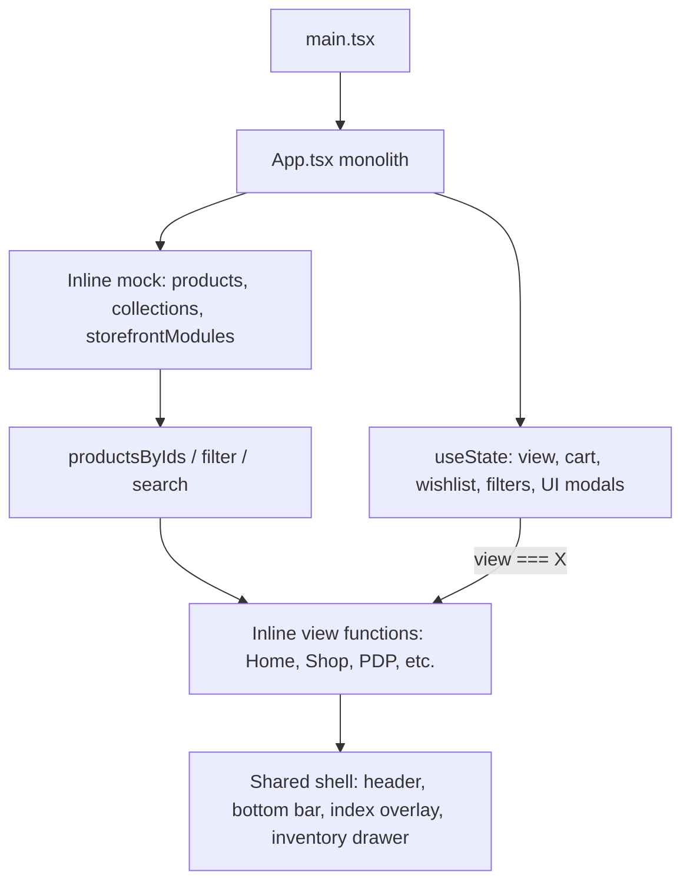
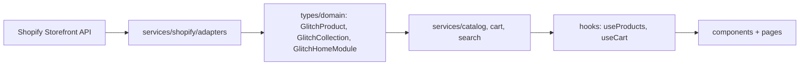
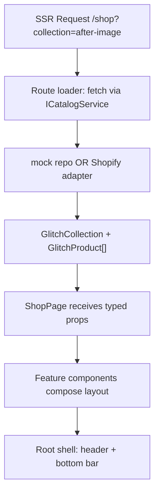

# GLITCH Engineering Architecture Review

## Executive Summary

The exported prototype is a **visual-first, engineering-minimal** Vite + React SPA. All application logic, mock data, navigation, cart/wishlist state, and nine screen views live in a single file: [`src/app/App.tsx`](src/app/App.tsx) (~215 lines). Supporting infrastructure exists (Tailwind tokens, shadcn/ui kit, blueprint docs) but is largely **unused or disconnected** from the running app.

This is the expected Figma Make output. The path to production is not a redesign—it is a **structural decomposition** behind an unchanged visual layer, followed by a **framework migration to SSR** (per your decision) and a **Shopify normalization boundary**.

---

## 1. Current Architecture Assessment

### Rendering Flow (Today)



**Entry:** [`src/main.tsx`](src/main.tsx) mounts `<App />` with global styles from [`src/styles/index.css`](src/styles/index.css).

**Navigation:** Not URL-based. A `View` union type drives rendering via `useState<View>("home")` and a manual `routeHistory` stack (`go` / `back`). Browser back/forward, deep links, and refresh-to-same-screen **do not work**.

**State:** All ephemeral React state in `App()`:
- Navigation: `view`, `routeHistory`, `navOpen`
- Catalog filters: `collection`, `category`, `query`
- Commerce: `cart: Product[]`, `wishlist: number[]`, `selected`, `size`, `quantity`
- UI: `inventoryOpen`, `strip` (carousel index)

**Data:** Hardcoded in `App.tsx`:
- 8 products, 3 collections, derived categories
- `storefrontModules` config (partial homepage engine seed)
- All images are external Unsplash URLs (no [`src/assets`](src/assets))

**Components actually used:** Only 4 extracted inside `App.tsx`: `SystemLabel`, `SectionHeading`, `ProductCard`, `BottomControl`. Everything else is inline JSX per view.

**Dependencies vs usage:**

| Package | Status |
|---------|--------|
| `react-router` | Installed, **never imported** |
| `motion` | Installed, **unused in App** |
| shadcn/ui (~40 files) | Present, **unused by App** |
| `@mui/*`, `recharts`, `react-dnd`, `react-slick`, etc. | **Dead weight** |
| GSAP, Lenis | **Not installed** (blueprint future) |

---

## 2. Current Strengths

1. **Approved visual system is cohesive** — typography (Archivo Black / Manrope / mono labels), color tokens in [`src/styles/theme.css`](src/styles/theme.css), spacing, mobile-first layouts, bottom thumb-zone controls.
2. **Homepage module seed exists** — `StorefrontModules` + `storefrontModules` + `productsByIds()` already implement conditional section rendering (sections hide when data is empty).
3. **Empty states are designed** — shop grid, archive, wishlist, cart, search all handle zero-data gracefully.
4. **Product card peek state prepared** — `expanded` prop on `ProductCard` with `data-card-state` / `data-future-interaction` attributes aligns with blueprint long-press plans.
5. **Design documentation is strong** — [`src/imports/glitch-blueprint.md`](src/imports/glitch-blueprint.md) and [`src/imports/pasted_text/blueprint-guidelines.md`](src/imports/pasted_text/blueprint-guidelines.md) define interaction/motion philosophy for later phases.
6. **Vite + Tailwind v4 + `@/` alias** already configured in [`vite.config.ts`](vite.config.ts).

---

## 3. Current Weaknesses

### Structural
- **Single-file monolith** — no separation of pages, features, data, or types.
- **Inline page components** (`Home`, `Shop`, `Collections`, etc.) re-created on every render inside `App()`.
- **No folder architecture** beyond `app/components/ui/` (shadcn boilerplate) and one unused `ImageWithFallback`.

### Navigation
- **No real routing** despite `react-router` in [`package.json`](package.json).
- **No deep linking** — `/product/offset-shell` impossible.
- **Browser history broken** — back button exits site or skips expected in-app flow.
- **Inconsistent back behavior** — product page uses history stack; other pages use fixed back button; home/product hide back differently.
- **Filter state leaks across views** — changing collection on Collections page affects Shop/Wishlist filters globally.

### Data Model
- **UI-shaped mock types** — `Product` has `price: string`, `tone: string` (Tailwind gradient), `tag`, `wide?: boolean` mixed with commerce fields.
- **No stable identifiers** — numeric `id` only; no `handle`/slug for Shopify.
- **No variants** — size hardcoded `["XS","S","M","L"]`; colors are decorative divs, not data.
- **No inventory, description, image gallery** — PDP copy is hardcoded string.
- **Collections joined by display name string** — fragile when Shopify renames.
- **Categories derived at runtime** from products — no first-class category entity.

### Commerce State
- **Cart stores `Product[]` duplicates** — not line items with `{ variantId, size, qty, price }`.
- **Size not bound to cart lines** — cart displays global `size` state, wrong for multi-item carts.
- **Wishlist is in-memory IDs** — lost on refresh; no variant awareness.
- **No checkout path** — cart ends at profile stub.

### Search
- **Client-side substring filter** over 8 items — `queryResults = products.filter(...)`.
- **No pagination, facets, typeahead, or trending from API**.
- **SearchView layout bug** — nests `<ShopGrid>` (which renders a grid) inside another grid wrapper.

### Scalability Blockers
- All catalog data loaded eagerly in memory.
- Homepage carousel uses `strip` index over full array — no virtualization.
- Collection tabs render all collections — no pagination for hundreds.
- Product grid is unbounded `map()` — will degrade at thousands of SKUs without pagination/virtualization.

### Shopify Readiness
- **No normalization layer** — components consume raw mock shape.
- **Presentation fields in domain model** (`tone`, `wide`) — must come from layout rules or metafields, not product core schema.
- **Homepage not a true module registry** — section order and types are hardcoded in JSX, not driven by a module list.

---

## 4. Architectural Risks

| Risk | Impact | Likelihood |
|------|--------|------------|
| Refactoring monolith without visual regression guard | UI drift breaks client approval | High without screenshot/CSS snapshot tests |
| SSR migration (Vite → Remix/Next) late | Double migration cost | Medium if deferred |
| Cart/wishlist model wrong before Shopify | Checkout integration rewrite | High if not fixed in Phase 2 |
| String-based collection/category joins | Broken filters after CMS rename | High |
| Bundle bloat from unused deps | Performance on mobile | Medium |
| Motion added before component boundaries | Animation logic entangled in pages | High (mitigated: motion after structure) |
| No image optimization | LCP/CLS issues at scale | High with Shopify CDN images |

---

## 5. Shopify Readiness Assessment

**Current score: 2/10** (visual layouts are adaptable; data architecture is not)

**What works:**
- Conditional homepage sections can map to metafield-driven modules.
- Empty-state-first layouts support optional Shopify content.
- UI copy/navigation metaphor ("inventory", "objects") is presentation-only.

**What must change before Shopify:**
1. **Glitch domain schema** decoupled from Shopify shapes.
2. **Normalization adapters** (`Shopify → GlitchProduct`, etc.).
3. **Handles/slugs** for URLs and API queries.
4. **Money type** `{ amount, currencyCode }` not `"$280"`.
5. **Variant-aware cart** using Storefront Cart API.
6. **Collection/category by ID/handle**, not display name.
7. **Homepage module registry** from metaobjects or CMS JSON.
8. **Search service** wrapping Shopify Predictive Search / search API.

**Recommended Shopify boundary:**



**UI rule:** No file under `components/` or `pages/` imports `@shopify/*` or raw Storefront types.

---

## 6. Scalability Assessment

| Area | Current | At 8 SKUs | At 500 SKUs | At 5000 SKUs |
|------|---------|-----------|-------------|--------------|
| Product listing | In-memory filter | OK | Slow render | Broken |
| Search | JS filter | OK | Needs API | Needs API |
| Homepage | Static resolve | OK | OK | OK (module-driven) |
| Collections | Hardcoded 3 | OK | Needs pagination | Needs pagination |
| Cart | Local array | OK | OK | Needs Shopify Cart |
| Images | Unsplash URLs | OK | Needs CDN + srcset | Critical |

**Required scale patterns (later phases):**
- Cursor-based pagination for PLP/search.
- Route-level data loading (SSR).
- Image component with `srcset`, lazy load, aspect ratio (use [`ImageWithFallback`](src/app/components/figma/ImageWithFallback.tsx) as base).
- Optional virtualization for dense grids (mobile-first: paginate before virtualize).

---

## 7. Proposed Target Architecture

**Recommendation: Remix (Shopify Hydrogen patterns) or Next.js App Router** for SSR from day one.

Given headless Shopify + SSR requirement, **Remix via Hydrogen conventions** is the strongest fit (Storefront API loaders, cart session, Oxygen deployment). **Next.js** is equally viable if the team prefers Vercel/Next ecosystem—the normalization boundary is identical.

**Phased framework strategy (preserves UI):**
1. **Phase A (Vite):** Extract components/types/data behind stable props — zero visual change, enables testing.
2. **Phase B (SSR shell):** Port extracted tree into Remix/Next routes; replicate exact CSS/tokens.
3. **Phase C:** Swap mock repositories for Shopify adapters route-by-route.

This avoids refactoring motion twice and gives a visual-regression baseline before SSR.

---

## 8. Folder Structure Recommendation

Adapt the suggested structure to **feature-sliced + domain boundary** (better than flat `components/` at scale):

```
src/
  app/                          # SSR framework root (Remix routes or Next app/)
    routes/                     # home, shop, collections/$handle, products/$handle, search, cart, wishlist, account
    root.tsx                    # shell: header, bottom bar, providers
  components/
    ui/                         # shadcn (trim unused over time)
    primitives/                 # SystemLabel, SectionHeading, BottomControl
    product/                    # ProductCard, ProductGrid, ProductPeek
    collection/                 # CollectionCard, CollectionTabs, CollectionHero
    cart/                       # InventoryDrawer, CartLine, CartSummary
    navigation/                 # AppHeader, BottomBar, IndexOverlay
    search/                     # SearchInput, SearchResults, RecentlyViewed
    layout/                     # SectionShell, EmptyState, PageContainer
  features/
    homepage/
      modules/                  # HeroModule, FeaturedProductsModule, EditorialModule, ...
      HomepageRenderer.tsx      # module registry engine
      module-registry.ts        # type → component map
    catalog/                    # filters, PLP logic
    product-detail/
    archive/
    wishlist/
    cart/
    search/
  domain/
    types/                      # GlitchProduct, GlitchVariant, GlitchCollection, GlitchCartLine, GlitchHomeModule
    schemas/                    # runtime validation (Zod) optional
  services/
    catalog/                    # ICatalogService interface
    cart/
    search/
    homepage/
    shopify/                    # Storefront client, mappers, queries (never imported by components)
  data/
    mock/                       # mock products, collections, homepage config
    fixtures/
  hooks/                        # useCart, useWishlist, useCatalog, useHomepage
  providers/                    # CartProvider, WishlistProvider, MotionProvider (later)
  config/                       # feature flags, env, nav config
  animations/                   # GSAP/Lenis/motion (Phase 6+)
  styles/                       # existing tokens
  utils/                        # money format, handle helpers
```

**Why feature-sliced:** Homepage module engine, cart, and search have distinct lifecycles and Shopify touchpoints—isolating them prevents another monolith.

---

## 9. Rendering Flow Recommendation

### Target flow



### Homepage as rendering engine

Replace hardcoded `{featuredProducts.length > 0 && <section>...}` chain with:

```typescript
// Conceptual — not implemented yet
type HomeModule =
  | { type: 'hero'; props: HeroModuleProps }
  | { type: 'featuredProducts'; props: ProductRailProps }
  | { type: 'collectionPreview'; props: CollectionGridProps }
  // ...

function HomepageRenderer({ modules }: { modules: HomeModule[] }) {
  return modules.map((m) => <ModuleRegistry key={m.id} module={m} />);
}
```

**Why:** Shopify metaobjects/CMS can emit ordered module JSON; UI stays unchanged because each module component is extracted from current JSX verbatim.

### Product rendering
- `ProductCard` accepts `GlitchProduct` + layout hints (`emphasis: 'wide' | 'default'`, `compact: boolean`) — move `wide`/offset layout from product data to **module layout config**.

---

## 10. Data Flow Recommendation

```
Shopify Storefront API
        ↓
  shopify/queries/*.ts        (GraphQL documents)
        ↓
  shopify/adapters/*.ts       (normalize to domain)
        ↓
  services/*.ts               (ICatalogService, ICartService — mock or live)
        ↓
  route loaders / hooks
        ↓
  feature/page components
        ↓
  presentational components
```

**Mock-first:** Implement `MockCatalogService` returning data from [`data/mock/`](src/data/mock/) using the **same interfaces** as Shopify services. Swapping data source becomes a DI/config change.

**Key domain types to define early:**
- `GlitchProduct` — id, handle, title, price, images, variants, collectionIds, tags, metafields
- `GlitchVariant` — id, size, color, available, price
- `GlitchCollection` — id, handle, title, description, image, accentColor
- `GlitchCartLine` — lineId, variantId, quantity, attributes
- `GlitchHomeModule` — discriminated union for homepage engine

**Presentation vs domain separation:** `tone` gradients and `wide` card spans belong in **module layout config** or collection metafields—not core product records.

---

## 11. State Management Recommendation

| State | Phase 1–3 | Production |
|-------|-----------|------------|
| Server catalog | SSR loader data | Shopify loader + cache |
| Cart | React Context + reducer | Shopify Cart API session (Hydrogen pattern) |
| Wishlist | Context + localStorage | Customer metafield or Shopify wishlist app |
| UI modals (inventory drawer, index) | Local component state | Local component state |
| Filters (shop) | URL search params | URL search params |
| Recently viewed | localStorage | localStorage / customer metafield |

**Zustand:** Optional for client UI state (nav open, drawer)—not required initially. Use **Context + useReducer** for cart/wishlist during extraction; evaluate Zustand only if prop drilling becomes painful.

**Why URL params for filters:** Shareable shop views, SSR-friendly, back-button correct.

---

## 12. Migration Strategy

**Principles:**
1. **Visual freeze** — no typography/spacing/color changes.
2. **Extract, don't rewrite** — move JSX blocks verbatim into components.
3. **Interface before integration** — domain types + services before Shopify.
4. **One vertical slice at a time** — homepage first (most module value).
5. **Screenshot regression** — capture key breakpoints before/after each phase.

**Framework migration (SSR):**
- After Phase 2 extraction, create Remix/Next app with identical Tailwind config and copy component tree.
- Map each `View` to a route (see table below).
- Replace `go()`/`back()` with router navigation preserving history semantics.

| Current View | Target Route |
|--------------|--------------|
| home | `/` |
| shop | `/shop` |
| collections | `/collections` |
| collections (filtered) | `/collections/:handle` |
| product | `/products/:handle` |
| search | `/search` |
| archive | `/archive` |
| wishlist | `/wishlist` |
| cart | `/cart` |
| profile | `/account` |

---

## 13. Refactor Phases

### Phase 0 — Baseline (1–2 days)
- Visual regression snapshots (mobile + desktop: home, shop, PDP, cart).
- Document current behavior quirks (filter leakage, cart size bug).
- Dependency audit: mark safe-to-remove packages.

### Phase 1 — Foundation (3–5 days)
- Create `domain/types`, `data/mock`, `services` interfaces.
- Extract primitives: `SystemLabel`, `SectionHeading`, `BottomControl`.
- Extract `ProductCard`, `ProductGrid`, `CollectionTabs`, `EmptyState`.
- **Zero visual change.**

### Phase 2 — Page Decomposition (5–7 days)
- Extract views into `features/*/pages` or `pages/` components.
- Extract shell: `AppHeader`, `BottomBar`, `IndexOverlay`, `InventoryDrawer`.
- Move mock data out of components into `data/mock`.
- Introduce `MockCatalogService`, `MockHomepageService`.

### Phase 3 — Homepage Module Engine (3–4 days)
- Define `GlitchHomeModule` union type.
- Build `HomepageRenderer` + per-module components from existing Home JSX.
- Drive order from `homepage-modules.json` mock config (replaces inline `storefrontModules` + hardcoded section order).

### Phase 4 — Real Routing + URL State (4–6 days)
- Wire `react-router` (Vite) OR begin Remix/Next port.
- URL-driven product/collection/search/filter state.
- Fix cart line model (variant, size, qty per line).
- Persist wishlist to localStorage.

### Phase 5 — SSR Framework Port (7–10 days)
- Remix/Next project with identical UI tree.
- SSR loaders calling mock services.
- SEO metadata per product/collection.
- Prepare Oxygen/Vercel deployment config.

### Phase 6 — Shopify Integration (10–15 days)
- Storefront API client + adapters.
- Cart API integration.
- Predictive search.
- Metafields for homepage modules, editorial, archive flags.
- Feature flags in `config/`.

### Phase 7 — Motion Layer (8–12 days, after structure stable)
- Install GSAP + Lenis + `@use-gesture/react` (or blueprint choice).
- Central `GlitchFeedbackLayer` for Level-3 effects.
- Product card idle/proximity/drag per blueprint.
- `prefers-reduced-motion` fallbacks.

---

## 14. Risk Analysis

| Phase | Primary Risk | Mitigation |
|-------|-------------|------------|
| 1–2 Extraction | Subtle CSS/class drift | Snapshot tests; copy JSX verbatim |
| 3 Module engine | Section order/conditional logic change | Unit tests for module resolver; parity screenshots |
| 4 Routing | Broken back/nav flows | E2E tests for top journeys |
| 5 SSR port | Hydration mismatch | SSR only for data; client-only for drawers initially |
| 6 Shopify | Metafield schema churn | Versioned module schema; adapter tests |
| 7 Motion | Performance regression | Lazy-load animation libs; disable L0 under reduced motion |

**Do-not-do list during refactor:**
- Redesign layouts or simplify UI.
- Replace product card visual design.
- Add hover-only interactions without touch equivalents.
- Import Shopify types into UI components.

---

## 15. Estimated Refactor Complexity

| Scope | Effort | Notes |
|-------|--------|-------|
| Phases 0–2 (extract monolith) | **~2 weeks** | Low LOC but high precision |
| Phase 3 (homepage engine) | **~1 week** | Seed already exists |
| Phase 4 (routing/state) | **~1–1.5 weeks** | Cart model fix included |
| Phase 5 (SSR port) | **~2 weeks** | Largest structural change |
| Phase 6 (Shopify) | **~2–3 weeks** | Depends on metafield design |
| Phase 7 (motion) | **~2 weeks** | Blueprint Level 0–3 hierarchy |
| **Total to production storefront** | **~10–14 weeks** | 1 senior FE + part-time Shopify config |

**Complexity rating: Medium** — small codebase volume, **high architectural precision** required to preserve approved UI and avoid double-work.

---

## Immediate Next Steps (Awaiting Your Approval)

1. **Approve this architecture direction** (Remix/Hydrogen vs Next.js — team preference).
2. **Phase 0:** Capture visual regression baseline.
3. **Phase 1:** Create domain types + extract primitives/product components without visual change.
4. **Defer:** GSAP/Lenis, Shopify API, dependency pruning (until extraction stabilizes).

No files will be modified until you approve proceeding with Phase 0/1.
